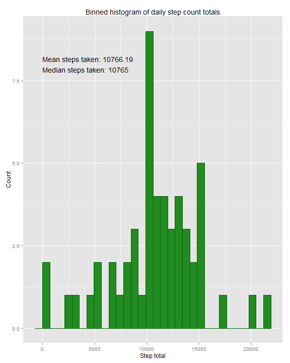
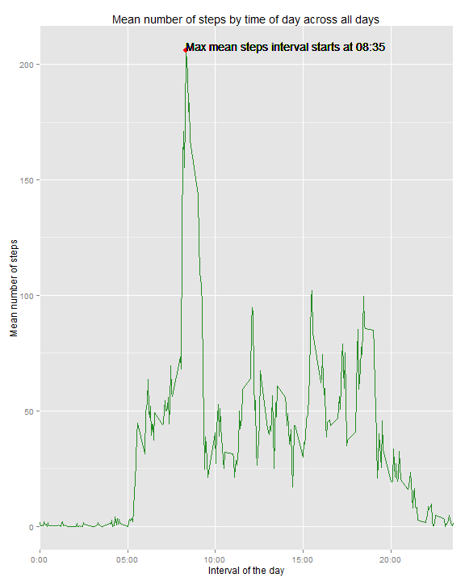
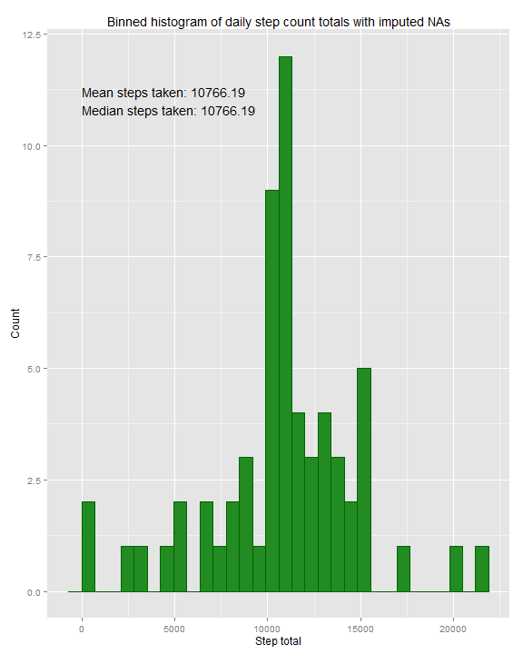
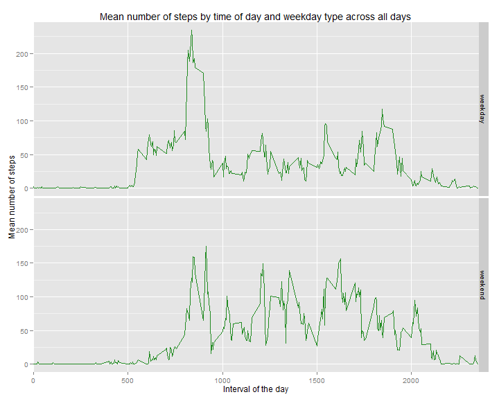

Title
========================================================

First, read in the data (assume it is in your working directory)

```r
activity_Data <- read.csv("activity.csv",colClasses = c("numeric", "Date", "numeric"))
head(activity_Data)
```

```
##   steps       date interval
## 1    NA 2012-10-01        0
## 2    NA 2012-10-01        5
## 3    NA 2012-10-01       10
## 4    NA 2012-10-01       15
## 5    NA 2012-10-01       20
## 6    NA 2012-10-01       25
```


Now that we have our data, let look at the questions we want to answer:

***What is mean total number of steps taken per day?***

Use the `reshape2` library and `aggregate()` function to find the total steps per day.

```r
library(reshape2)
#Find the total steps by day, ignoring NA values
daily_Steps <- aggregate(formula = steps~date, data = activity_Data, FUN = sum, na.rm=TRUE)
```

Plot a histogram of the total values, and report the mean and median

```r
#Let's use ggplot
library(ggplot2)
step_Plot <- ggplot(data = daily_Steps)+
    geom_histogram(aes(steps), fill = "forestgreen", colour = "darkgreen")+
    labs(x = "Step total", y = "Count", title = "Binned histogram of daily step count totals")+
    #Calulate the mean and median across all days and insert into the plot
    annotate(geom = "text", x = 0, y = 8, hjust = 0, label = paste("Mean steps taken:", round(mean(daily_Steps$steps),digits = 2),"\nMedian steps taken:", median(daily_Steps$steps),sep=" ")) 

step_Plot
```

 

Next, we want to make a time series plot of the average number of steps based on time of day to answer the question:

***What is the average daily activity pattern?***

Once again, we can use the `reshape2` library and `aggregate()` function to extract the statistics we need, then use ggplot to plot the results.

```r
#Find the mean by time of day
TS_Steps <- aggregate(formula = steps~interval, data = activity_Data, FUN = mean, na.rm=TRUE)
#Format the variable as a time for nice looking x values in the plot
TS_Steps$time <- paste(substr(sapply(TS_Steps$interval, formatC, width = 4, flag = 0),1,2),":",substr(sapply(TS_Steps$interval, formatC, width = 4, flag = 0),3,4),sep="")

#Plot the time series and its maximum value
step_TS <- ggplot(data = TS_Steps)+
    geom_line(aes(x = interval, y = steps),colour = "forestgreen")+
    labs(x = "Interval of the day", y = "Mean number of steps", title = "Mean number of steps by time of day across all days")+
    geom_point(aes(x = interval[which(steps==max(steps))],y = max(steps)),colour="red", size = 3)+
    geom_text(aes(x = interval[which(steps==max(steps))],y = max(steps)),label = paste("Max mean steps interval starts at",TS_Steps$time[which(TS_Steps$steps==max(TS_Steps$steps))]), hjust = 0, vjust = 0)+
    scale_x_discrete(breaks = c(seq(0,2000,500)),labels=c("0:00", "05:00", "10:00", "15:00", "20:00"))

step_TS
```

 

Our next step is to impute the `NA` values with new values and see how that affects the results.
First calculate how many `NA` values there are in the data:

```r
length(which(is.na(activity_Data)))
```

```
## [1] 2304
```
Then substitute a value for each of the `NA` values. I will use the mean based on interval to impute my `NA`s using `TS_Steps` data calculated earlier

```r
imputed_Data = merge(activity_Data,TS_Steps[,1:2],by = "interval")
imputed_Data$steps = ifelse(is.na(imputed_Data$steps.x),imputed_Data$steps.y,imputed_Data$steps.x)
imputed_Data = imputed_Data[,-c(2,4)]

imputed_Daily = aggregate(formula = steps~date, data = imputed_Data, FUN = sum, na.rm=TRUE)

imputed_Plot <- ggplot(data = imputed_Daily)+
    geom_histogram(aes(steps), fill = "forestgreen", colour = "darkgreen")+
    labs(x = "Step total", y = "Count", title = "Binned histogram of daily step count totals with imputed NAs")+
    #Calulate the mean and median across all days and insert into the plot
    annotate(geom = "text", x = 0, y = 11, hjust = 0, label = paste("Mean steps taken:", round(mean(imputed_Daily$steps),digits = 2),"\nMedian steps taken:", round(median(imputed_Daily$steps),digits=2),sep=" "))

imputed_Plot
```

 

As we can see, using these values in place of `NA`s makes no difference in the mean, and very little difference in the median

```r
paste("Original - Mean:",round(mean(daily_Steps$steps),digits = 2),"Median:",median(daily_Steps$steps)) #Original 
```

```
## [1] "Original - Mean: 10766.19 Median: 10765"
```

```r
paste("Imputed - Mean:",round(mean(imputed_Daily$steps),digits = 2), "Median:",round(median(imputed_Daily$steps),digits=2)) #Imputed
```

```
## [1] "Imputed - Mean: 10766.19 Median: 10766.19"
```

Finally, we would like to answer the question:

***Are there differences in activity patterns between weekdays and weekends?***

To answer this, we will first add a new column of factors to the original data, defining the step count as happening on a weekend, or weekday

```r
activity_Data$day_Type = as.factor(ifelse((weekdays(activity_Data$date)=="Sunday"|weekdays(activity_Data$date)=="Saturday"),"weekend", "weekday"))
```

We then finish by making a panel plot containing the time series of step count on the 5-minute intervals for weekends and weekdays:

```r
TS_Day_Steps <- aggregate(formula = steps~interval+day_Type, data = activity_Data, FUN = mean, na.rm=TRUE)

step_day_TS <- ggplot(data = TS_Day_Steps)+
    geom_line(aes(x = interval, y = steps),colour = "forestgreen")+
    labs(x = "Interval of the day", y = "Mean number of steps", title = "Mean number of steps by time of day and weekday type across all days")+
    scale_x_discrete(breaks = c(seq(0,2000,500),labels=c("0:00", "05:00", "10:00", "15:00", "20:00")))+
    facet_grid(day_Type~.)
    

step_day_TS
```

 


